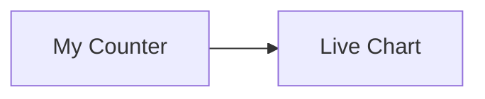
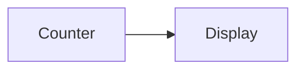

# m2rf - Mermaid to ReactFlow

> Render Mermaid diagrams as interactive ReactFlow graphs with embedded React components

## Features

- 🎨 **Write Mermaid, render ReactFlow** - Use familiar Mermaid syntax
- ⚛️ **Embed React components** - Convention-based component resolution
- 🔄 **Shared state with Zustand** - Components communicate via reactive state
- 🎯 **Tailwind-first** - Style everything with Tailwind classes
- 📊 **Perfect for MDX** - Drop into blog posts, docs, presentations
- 🚀 **TypeScript native** - Fully typed API

## Installation

```bash
npm install m2rf react react-dom reactflow zustand
# or
bun add m2rf react react-dom reactflow zustand
```

## Quick Start

```tsx
import { MermaidFlow } from 'm2rf';
import { create } from 'zustand';
import 'm2rf/styles.css';

const useStore = create((set) => ({
  count: 0,
  increment: () => set((s) => ({ count: s.count + 1 })),
}));

const Counter = ({ data }) => {
  const count = useStore((s) => s.count);
  const increment = useStore((s) => s.increment);

  return (
    <button onClick={increment}>
      Count: {count}
    </button>
  );
};

export default function App() {
  return (
    <MermaidFlow
      store={useStore}
      components={{ Counter }}
      height="600px"
    >
      {`
        flowchart LR
          A[Start] --> B[Counter] --> C[End]
      `}
    </MermaidFlow>
  );
}
```

## Convention-Based Component Resolution

Node text automatically maps to components:



Maps to:
- `[My Counter]` → `<MyCounter />`
- `[Live Chart]` → `<LiveChart />`

## Usage in MDX

```mdx
import { MermaidFlow } from 'm2rf';
import { Counter, Display } from './components';

<MermaidFlow components={{ Counter, Display }}>

</MermaidFlow>
```

## API

### `<MermaidFlow>`

| Prop | Type | Description |
|------|------|-------------|
| `children` | `string` | Mermaid diagram text |
| `components` | `Record<string, Component>` | Component registry |
| `edgeComponents` | `Record<string, Component>` | Edge component registry |
| `store` | `UseBoundStore` | Zustand store |
| `className` | `string` | Container class |
| `height` | `string \| number` | Container height |
| `direction` | `'TB' \| 'LR' \| 'RL' \| 'BT'` | Layout direction |
| `theme` | `'light' \| 'dark'` | Theme |

### `useFlowStore`

Access Zustand store from inside components:

```tsx
import { useFlowStore } from 'm2rf';

const MyComponent = () => {
  const count = useFlowStore((s) => s.count);
  return <div>{count}</div>;
};
```

## Examples

See the `examples/` directory for:
- Counter with shared state
- Data visualization components
- Real-time data flow
- Custom edge components

## License

MIT
