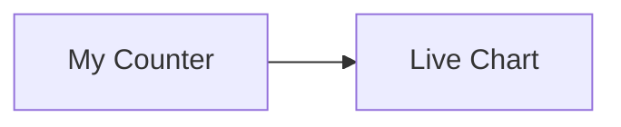
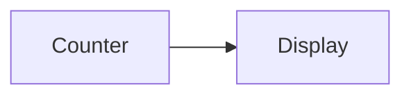

# m2rf

## Mermaid to ReactFlow

Render Mermaid diagrams as interactive ReactFlow graphs with embedded React components

## Features

- **Write Mermaid, render ReactFlow** - Use familiar Mermaid syntax
- **Embed React components** - Convention-based component resolution
- **Shared state with XState** - Components communicate through actors
- **Tailwind-first** - Style with Tailwind
- **MDX focused** - Drop into MDX based docs

## Design

See [DESIGN.md](DESIGN.md) for the current product and API design.

## Installation

```bash
bun add m2rf react react-dom reactflow xstate
```

## Quick Start

```tsx
import { MermaidFlow, useFlowActor, useFlowSnapshot } from 'm2rf';
import { assign, createActor, setup } from 'xstate';
import 'm2rf/styles.css';

const machine = setup({
  actions: {
    incrementCount: assign({
      count: ({ context }) => context.count + 1,
    }),
  },
}).createMachine({
  context: { count: 0 },
  on: {
    'count.incremented': { actions: ['incrementCount'] },
  },
});

const actor = createActor(machine).start();

const Counter = ({ data }) => {
  const flowActor = useFlowActor();
  const count = useFlowSnapshot((snapshot) => snapshot.context.count);

  return (
    <button onClick={() => flowActor.send({ type: 'count.incremented' })}>
      Count: {count}
    </button>
  );
};

export default function App() {
  return (
    <MermaidFlow
      actor={actor}
      components={{ Counter }}
      height="600px"
    >
      {`
        flowchart LR
          A[Start] --> B[Counter] --> C[End]
      `}
    </MermaidFlow>
  );
}
```

## Convention-Based Component Resolution

Node text automatically maps to components:



Maps to:
- `[My Counter]` → `<MyCounter />`
- `[Live Chart]` → `<LiveChart />`

## Usage in MDX

```mdx
import { MermaidFlow } from 'm2rf';
import { Counter, Display } from './components';

<MermaidFlow components={{ Counter, Display }}>

</MermaidFlow>
```

## Private Site Deployment

Deploy the studio with Vercel, not GitHub Pages.

Use these Vercel project settings:

| Setting | Value |
| --- | --- |
| Framework Preset | Next.js |
| Root Directory | `site` |
| Install Command | `pnpm install --frozen-lockfile` |
| Build Command | `pnpm build` |
| Include source files outside Root Directory | Enabled |
| Production Deployment Protection | Enabled |

Set production environment values in Vercel:

```sh
NEXT_PUBLIC_M2RF_AUTH_ENABLED=true
BETTER_AUTH_URL=https://<private-vercel-domain>
BETTER_AUTH_SECRET=<32+ chars>
GITHUB_CLIENT_ID=<github app client id>
GITHUB_CLIENT_SECRET=<github app client secret>
```

Add the GitHub OAuth callback URL:

```text
https://<private-vercel-domain>/api/auth/callback/github
```

The repo config in `site/vercel.json` sets the build commands and noindex
headers. Private access is enforced in Vercel's Deployment Protection settings.

## API

### `<MermaidFlow>`

| Prop | Type | Description |
|------|------|-------------|
| `children` | `string` | Mermaid diagram text |
| `components` | `Record<string, Component>` | Component registry |
| `edgeComponents` | `Record<string, Component>` | Edge component registry |
| `actor` | `AnyActorRef` | XState actor |
| `className` | `string` | Container class |
| `height` | `string \| number` | Container height |
| `direction` | `'TB' \| 'LR' \| 'RL' \| 'BT'` | Layout direction |
| `theme` | `'light' \| 'dark'` | Theme |

### `useFlowActor`

Access the XState actor from inside components:

```tsx
import { useFlowActor, useFlowSnapshot } from 'm2rf';

const MyComponent = () => {
  const actor = useFlowActor();
  const count = useFlowSnapshot((snapshot) => snapshot.context.count);

  return <div>{count}</div>;
};
```

More to come! 

## License

MIT
